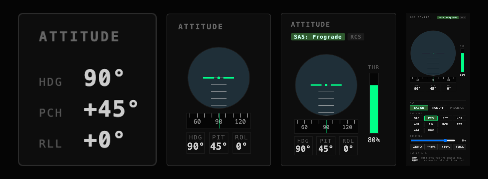
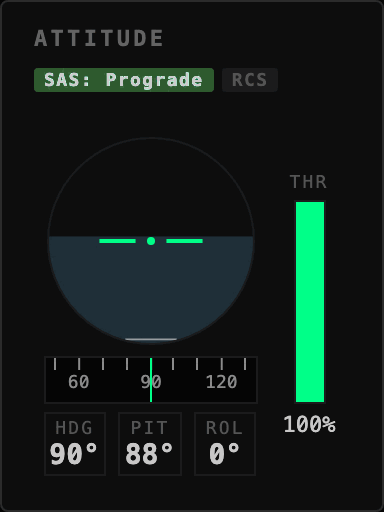

# gonogo

A mission control web app for [Kerbal Space Program](https://www.kerbalspaceprogram.com/).

<!-- TODO: hero dashboard screenshot: full main screen mid-flight, several widgets live -->

gonogo is a way to play KSP through a browser dashboard instead of the main game screen. With the exception of VAB/SPH, you can run the whole game from it: take contracts, run science, spend funds, launch, and take on missions.

The main screen dashboard is a widget-based interface that hooks into data in the game. It pulls from Telemachus\*, kOS, SCANsat, and HullCameraVDS/Kerbcam. Using this data you can see a live updating map view built from your scanners, watching video feeds from on-board cameras (and control them!), and customise live-updating graphs. There's lot of widgets for lots of different uses.

You can use widget profiles to dynamically switch dashoards based on what you're doing in the game. You can also **use gonogo as a multiplayer experience**. 'Stations' can register with the main screen and connect via a share code generated on the main screen. Stations get all the same data as the main screen, and can even push data for viewing on the main screen. One way to play is having the main screen as a general screen for everyone, and then everyone uses their own station screen for specialised data.

<!-- TODO: takeoff gif: launch clamp release through to gravity turn, telemetry widgets updating live -->

<p align="center">
  
  
</p>

---

## What you need

**If you just want to run a station**, simply go to https://jonpepler.github.io/gonogo/station and enter the share code. Everything should just work.

To host, you need:

- **Kerbal Space Program**, with the required mods installed: the gonogo build of Telemachus, kOS, and SCANsat. See [docs/KSP-SETUP.md](docs/KSP-SETUP.md) for the full list and how to install them.
- **A container runtime** on the computer that runs the main screen. This is the one piece of software you install to run gonogo itself. If you don't already have one, [Docker Desktop](https://www.docker.com/products/docker-desktop/) is the usual choice; follow their install guide for your operating system.

---

## How to run it

gonogo runs on your own computer, locally, to avoid the headache of setting up certificates. Start it with one command, which pulls the image and runs the main screen, the relay, and the kOS bridge together:

```bash
docker run -d --name gonogo --restart unless-stopped \
  --add-host=host.docker.internal:host-gateway \
  -e KOS_HOST=host.docker.internal \
  -p 8080:8080 -p 3001:3001 -p 3002:3002 \
  -p 3478:3478/tcp -p 3478:3478/udp \
  -p 49160-49170:49160-49170/udp \
  ghcr.io/jonpepler/gonogo:latest
```

If KSP runs on a different computer from gonogo, point the kOS bridge at it with `-e KOS_HOST=<ksp-host>`. The wide UDP range is only needed to relay station connections from outside your network; see [docs/NETWORKING.md](docs/NETWORKING.md) if you want that.

Open [localhost:8080](http://localhost:8080) once it is running. Bear in mind that if you run KSP and gonogo on the same computer, you may have trouble with KSP pausing when minimised.

Once the main screen is up and pointed at KSP (walked through in [docs/KSP-SETUP.md](docs/KSP-SETUP.md)), load a game and you should see data coming in. The **Data Sources** button, the database icon in the bottom-right **+** menu, is where you configure where the main screen points.

### Adding a station screen

A station is any other browser: a tablet, a second laptop, a phone.

1. On the main screen, hover the **+** button (bottom-right) to reveal the expanded menu, and press the **Add station** button (the broadcast symbol) to get a share code
2. On the other device, open the station page at [jonpepler.github.io/gonogo/station](https://jonpepler.github.io/gonogo/station)
3. Enter the share code and connect

---

## How it works

gonogo runs in two modes from the same code:

- **Main screen** (`/`) is the only thing that talks to KSP. It connects to the game, hosts the live dashboard, and sends a snapshot of the data to every connected station
- **Station screen** (`/station`) is a connected dashboard with its own layout. Stations never touch KSP directly; they get everything from the main screen

```
KSP (Telemachus HTTP/WebSocket) ──► Main screen (direct)
KSP (kOS via telnet)            ──► telnet bridge ──► Main screen (WebSocket)
Main screen ◄──► Station screens (peer-to-peer data channels)
```

For the package layout and the widget / theme extension API, see [docs/ARCHITECTURE.md](docs/ARCHITECTURE.md).

---

## Where to go next

- **[docs/KSP-SETUP.md](docs/KSP-SETUP.md)**: the required mods, installing the gonogo Telemachus build, connecting the dashboard to KSP, signal loss and CommNet, kOS, and camera feeds
- **[docs/NETWORKING.md](docs/NETWORKING.md)**: running KSP and the main screen on two computers, and connecting stations across networks
- **[docs/ARCHITECTURE.md](docs/ARCHITECTURE.md)**: the package map, the data-source pattern, and the widget / theme / data-source extension API
- **[docs/DEPLOYMENT.md](docs/DEPLOYMENT.md)**: GitHub Pages and the backend container images (maintainer reference)
- **[packages/serial/README.md](packages/serial/README.md)**: wiring physical USB controllers (throttle quadrants, button boxes) to widget actions
- **[CONTRIBUTING.md](CONTRIBUTING.md)**: the developer setup, running the tests, and how to land a change
