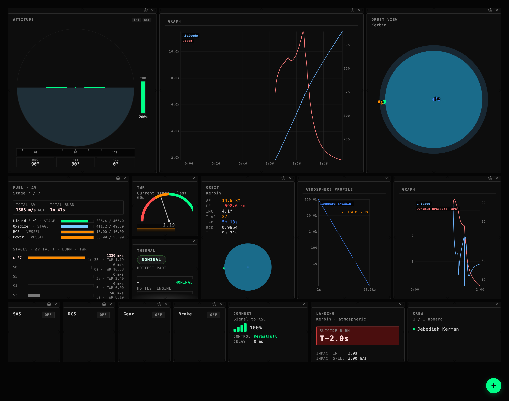
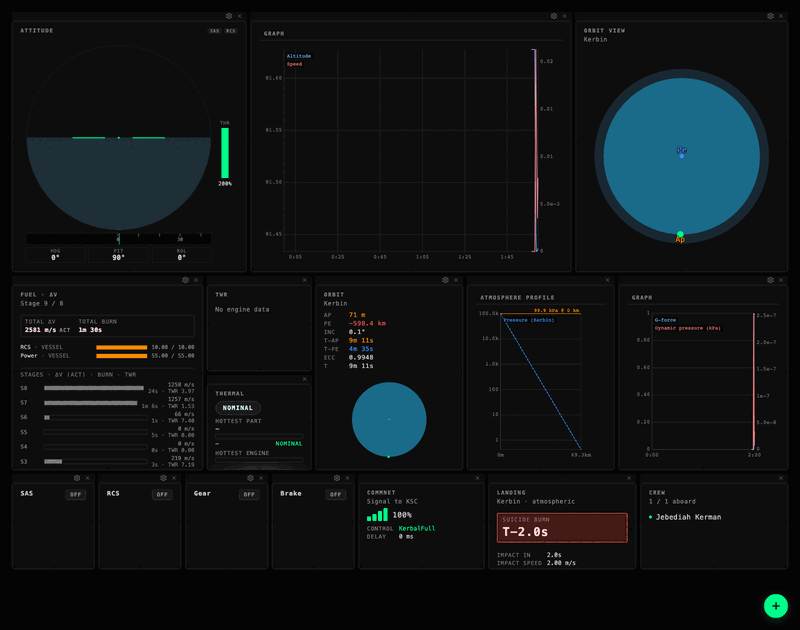
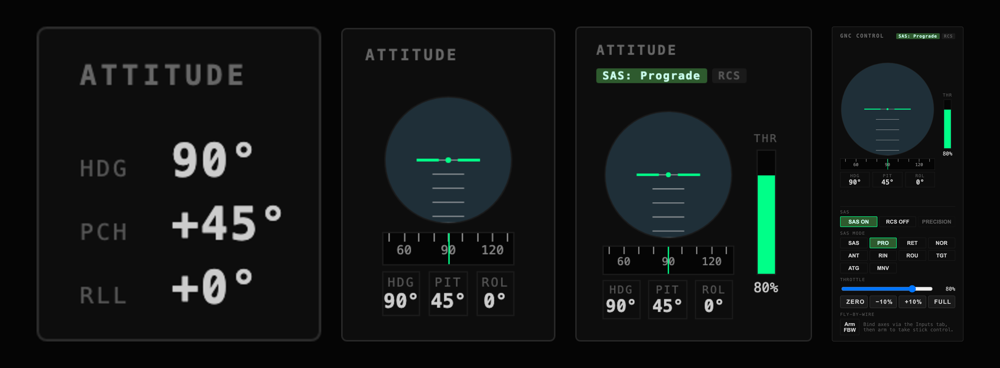
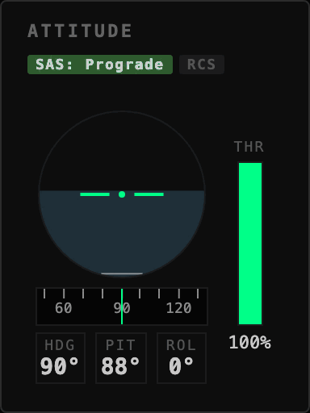

# gonogo

A mission control web app for [Kerbal Space Program](https://www.kerbalspaceprogram.com/).



gonogo is a way to play KSP through a browser dashboard instead of the main game screen. With the exception of VAB/SPH, you can run the whole game from it: take contracts, run science, spend funds, launch, and take on missions.

The main screen dashboard is a widget-based interface that hooks into data in the game. It pulls from the Gonogo mod (telemetry), kOS, SCANsat, and HullCameraVDS/Kerbcast. Using this data you can see a live updating map view built from your scanners, watch video feeds from on-board cameras (and control them!), and customise live-updating graphs. There are lots of widgets for lots of different uses.

You can use widget profiles to dynamically switch dashboards based on what you're doing in the game. You can also **use gonogo as a multiplayer experience**. 'Stations' can register with the main screen and connect via a share code generated on the main screen. Stations get all the same data as the main screen, and can even push data for viewing on the main screen. A station has its own layout and starts empty: you add its widgets yourself. One way to play is having the main screen as a general screen for everyone, and then everyone uses their own station screen for specialised data.

<p align="center">
  
</p>

<p align="center">
  
  
</p>

---

## What you need

**If you just want to run a station**, you need a share code from whoever runs the main screen. They open **Add station** on it and it shows the address to open on your device, with a QR code for it; see [Adding a station screen](#adding-a-station-screen). The public address is `https://ksp-gonogo.github.io/app/station`, which exists once the first release is published; until then, use the address Add Station shows for the main screen itself.

To host, you need:

- **Kerbal Space Program 1.12**, with the Gonogo mod installed. It is the only required mod; kOS, SCANsat and the camera mods are optional add-ons. See [docs/KSP-SETUP.md](docs/KSP-SETUP.md) for how to install them
- **Ideally a second computer** for KSP. KSP pauses when it is not the focused window, so on one computer the dashboard stops getting data whenever you switch to it. See [docs/NETWORKING.md](docs/NETWORKING.md)
- **A container runtime** on the computer that runs the main screen. This is the one piece of software you install to run gonogo itself. To see whether you already have one, run `docker --version` or `podman --version` in a terminal; either answering with a version is enough. If neither does, [Docker Desktop](https://www.docker.com/products/docker-desktop/) is the usual choice; follow their install guide for your operating system

---

## How to run it

gonogo runs on your own computer, locally, to avoid the headache of setting up certificates. Start it with one command, which pulls the image and runs the main screen and the relay together:

```bash
docker run -d --name gonogo --restart unless-stopped \
  --add-host=host.docker.internal:host-gateway \
  -e KSP_HOST=host.docker.internal \
  -p 8080:8080 -p 3002:3002 \
  -p 3478:3478/tcp -p 3478:3478/udp \
  -p 49160-49170:49160-49170/udp \
  ghcr.io/ksp-gonogo/gonogo:latest
```

The `latest` tag is published with the first release, and until then the pull is refused. Until the first release, use the release candidate image instead: change the last line to `ghcr.io/ksp-gonogo/gonogo:rc`. After the first release, use `latest`. The same applies to the `docker pull` below Podman takes the same command: type `podman` where it says `docker`.

That is the form for macOS, Linux and WSL. In Windows PowerShell, end each line with a backtick (`` ` ``) in place of the `\`, or type it as one line; the app's own setup screen prints the PowerShell form when it is opened on Windows.

`KSP_HOST` tells the dashboard where KSP is, and telemetry, kOS and camera feeds all start from it. The container does not connect to the game: the **browser** you open the main screen in does, straight to the mod on port 8090 (and to kerbcast on 8088 for cameras). The container only hands the browser the address to use, and `host.docker.internal` becomes `localhost` there. The command above assumes KSP runs on the same computer as that browser; if it runs on a different one, replace both `host.docker.internal` values with that computer's IP (e.g. `-e KSP_HOST=192.168.1.50`), the `--add-host` line is then unnecessary. That also means the firewall that matters is on the KSP computer, which has to accept incoming connections on port 8090 from the main screen computer, and the container's own ports are not involved. See [docs/NETWORKING.md](docs/NETWORKING.md). The wide UDP range is only needed to relay station connections from outside your network; see [docs/NETWORKING.md](docs/NETWORKING.md) if you want that.

Open [localhost:8080](http://localhost:8080) once it is running. Bear in mind that if you run KSP and gonogo on the same computer, you may have trouble with KSP pausing when minimised.

If the command fails with "port is already allocated", another program is using that port. Stop it, or publish the container on a different port by changing the left-hand number (`-p 9090:8080` serves the app at `localhost:9090`). If the container runs but the page stays blank, run `docker logs gonogo` and check that `docker ps` lists it as running.

### Updating

`docker run` (and `podman run`) never re-pulls a tag you already have, so running the command again keeps the old app without saying so. To update, pull first, then replace the container (use `podman` in place of `docker` if that is what you have):

```bash
docker pull ghcr.io/ksp-gonogo/gonogo:latest
docker rm -f gonogo
```

Then run the same `docker run` command again. (Pull `:rc` instead if that is the tag you run.) Update the Gonogo mod in KSP at the same time, since the app and the mod are released together and an old mod may lack channels a new app expects. CKAN does this for you; a hand install means deleting `GameData/Gonogo` and copying the new one in. The container holds no data of its own: your layouts, settings, share code and Uplink answers live in the browser, per address, so they survive as long as you keep opening the same address (`localhost:8080`). Stations keep theirs in their own browsers.

The app has no version readout in its screens yet (a station shows its version only when it differs from the main screen's). To see what you are running, open `http://localhost:3002/version`, or view the page source of the main screen and look for `gonogo-version`.

### What you see the first time

On a brand new browser, in this order:

1. If the Gonogo mod reports Uplinks installed in KSP, one dialog per Uplink asks **Load Uplink "..."?** An Uplink is an add-on that brings one other mod's widgets into the dashboard. **Load** runs that Uplink's code in the app with the same access as the rest of it, so only load ones you trust, and the answer is remembered for that version. **Don't load** leaves the Uplink out: its widgets do not appear, Settings → Uplinks says why, and you are asked again on the next page load
2. **Help improve gonogo?** asks whether to send anonymous logs and errors to the developer, with no mission data. **Enable** or **Decline**; you can change it later in Settings
3. **Set up Gonogo**, a six-step dialog that opens once: Welcome, Start the container, Connect to KSP, Uplinks, Health check, Done. Each step shows the command it needs and checks the result for you, and none blocks the next. The connection step is where you type the KSP computer's address if the game is on another computer. **Settings → Connection → Run setup again** opens it again

Then the dashboard itself is **empty**: it says "No widgets on this dashboard" and "Use the + button at the bottom right (Add component) to add one". A new station starts the same way. Load a game in KSP, add widgets (**System View** is a good first one), and you should see data coming in. The mod setup is walked through in [docs/KSP-SETUP.md](docs/KSP-SETUP.md). To point the main screen somewhere else later, use **Settings → Connection** in the bottom-right **+** menu, anything you save there overrides `KSP_HOST`.

### Adding a station screen

A station is any other browser: a tablet, a second laptop, a phone.

1. On the main screen, hover the **+** button (bottom-right), or Tab to it, to reveal the expanded menu (it stays hidden otherwise; pressing **+** itself opens the Add component list instead), and press the **Add station** button (the broadcast symbol). It shows a six-character share code, a QR code, and one or two addresses
2. On the other device, open one of those addresses (or scan the QR code, which carries the code in the link):
   - **This app**, your own main screen's address (`http://<main screen computer's address>:8080/station`): use it for a device on the same network, or another window on the main screen's own computer when the main screen is on localhost
   - **Public build** (`https://ksp-gonogo.github.io/app/station`): use it for a device on another network, which needs internet. It is shown beside your own address when the main screen is on localhost or a local address. It exists once the first release is published; before then it is a 404, so use your own address on the same network
3. If you opened the station page without the code in the link, enter the share code and connect. The new station is empty: press **+** (Add component) at the bottom right to add widgets

A station works only while the main screen's tab stays open and awake: it gets everything through that tab, so closing it, or a computer going to sleep, ends the session for every station until it is back. A station also asks **Load Uplink "..."?** on its own first load, the same prompt the main screen shows, and answers are remembered per browser.

---

## How it works

gonogo runs in two modes from the same code:

- **Main screen** (`/`) is the only screen that talks to KSP, and it is the browser on that computer that does it. It connects to the game, hosts the live dashboard, and sends a snapshot of the data to every connected station
- **Station screen** (`/station`) is a connected dashboard with its own layout. Stations never touch KSP directly; they get everything from the main screen

```
KSP + Gonogo mod (telemetry, WebSocket) ──► Main screen's browser (direct, port 8090)
KSP (kOS)                               ──► Gonogo mod Uplink (same WS) ──► Main screen's browser
Main screen ◄──► Station screens (peer-to-peer data channels)
```

**Extending it.** New telemetry, commands and widgets arrive as an **Uplink**: a KSP mod plus a client bundle, which you own, host and publish yourself, with no marketplace to submit to. The [Uplink developer docs](https://ksp-gonogo.github.io/uplink-dev-docs/) cover building one.

---

## Where to go next

- **[docs/KSP-SETUP.md](docs/KSP-SETUP.md)**: the required mods, installing the Gonogo mod, connecting the dashboard to KSP, signal loss and CommNet, kOS, and camera feeds
- **[docs/NETWORKING.md](docs/NETWORKING.md)**: running KSP and the main screen on two computers, and connecting stations across networks
- **[Uplink developer docs](https://ksp-gonogo.github.io/uplink-dev-docs/)**: building an Uplink, the extension unit for new telemetry, commands and widgets
- **[asyncapi.yaml](asyncapi.yaml)**: the mod's wire contract as an AsyncAPI document, every core telemetry channel and command with its payload schema and the contract's own explanation of it. Generated, never hand-edited
- **[docs/DEPLOYMENT.md](docs/DEPLOYMENT.md)**: GitHub Pages, the backend container images and the release candidate channel (maintainer reference)
- **[packages/serial/README.md](packages/serial/README.md)**: wiring physical USB controllers (throttle quadrants, button boxes) to widget actions
- **[CONTRIBUTING.md](CONTRIBUTING.md)**: the developer setup, running the tests, and how to land a change
