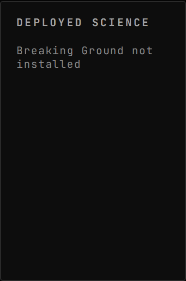
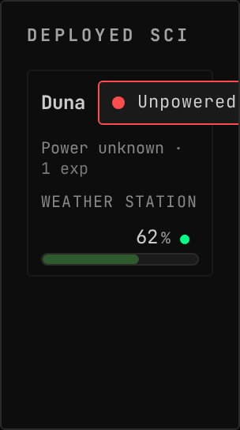
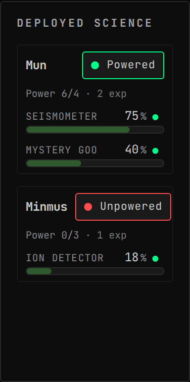
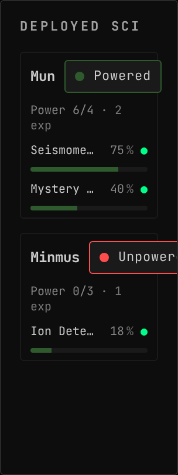
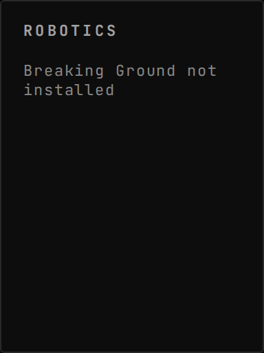
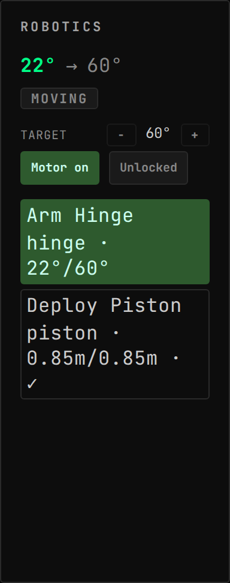
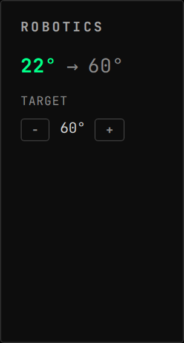
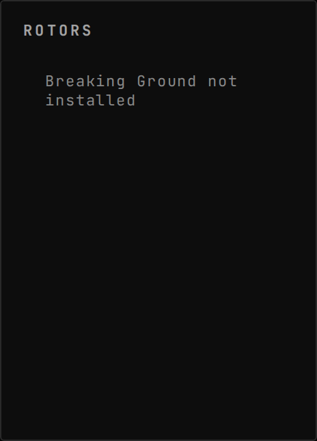
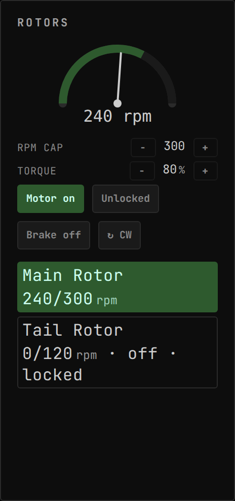
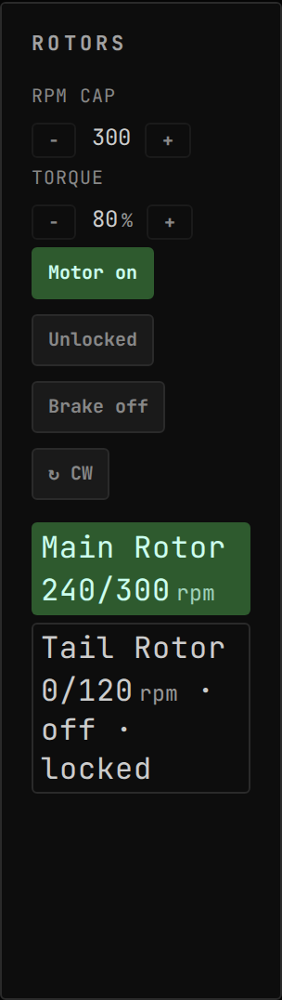

<!-- Generated by `gonogo-uplink docs`. Do not edit this file: it is written
     from the registrations, the contract slice and the fixtures. -->

# Breaking Ground

Drives Breaking Ground robotic joints and rotors from the console, and reports deployed surface bases on every body while you fly something else.

| | |
| --- | --- |
| Uplink id | `breakingGround` |
| Version | `0.0.1` |
| Built against | contract 16.1, api 1.0.0, ui-kit 0.1.0 |

## Widgets

### Deployed Science

Power balance and per-experiment science progress for Breaking Ground deployed surface bases on every body, reported even while you fly something else. Read-only.

| | |
| --- | --- |
| Widget id | `deployed-science` |
| Reads | `deployed.bases`, `game.dlc.breakingGround` |
| Slots | `deployed-science.experiment` |
| Default size | 5 × 9 |
| Scenes | 3 |

### Robotics Console

Current-vs-target position, at-target state and motor/lock controls for Breaking Ground robotic hinges, rotation servos and pistons. Select a joint to drive it from the stepper or a mapped input.

| | |
| --- | --- |
| Widget id | `robotics-console` |
| Reads | `robotics.servos`, `robotics.available.available` |
| Actions | `targetUp`, `targetDown`, `toggleMotor`, `toggleLock` |
| Only while present | `flight` |
| Default size | 5 × 8 |
| Scenes | 2 |

### Rotor Tachometer

Live RPM vs commanded cap for Breaking Ground robotic rotors, with motor, lock, brake and direction controls. Select a rotor to drive it from the dial or a mapped input.

| | |
| --- | --- |
| Widget id | `rotor-tachometer` |
| Reads | `robotics.servos`, `robotics.available.available` |
| Actions | `rpmUp`, `rpmDown`, `toggleMotor`, `toggleLock`, `reverse` |
| Only while present | `flight` |
| Default size | 6 × 10 |
| Scenes | 2 |

