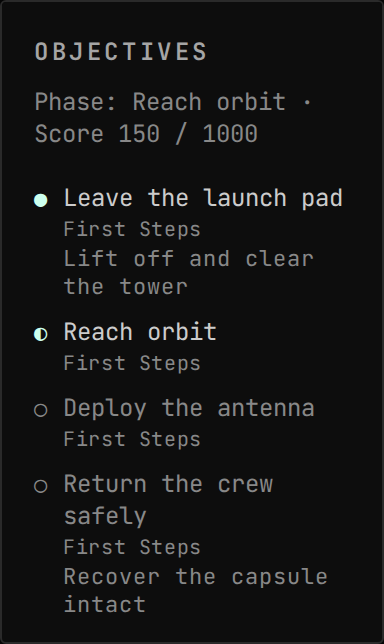

<!-- Generated by `gonogo-uplink docs`. Do not edit this file: it is written
     from the registrations, the contract slice and the fixtures. -->

# Making History

Lists the running Making History mission's objectives in the Objectives widget, each marked pending, under way, reached or failed.

| | |
| --- | --- |
| Uplink id | `makingHistory` |
| Version | `0.0.1` |
| Built against | contract 27.11, api 6.0.0, ui-kit 0.1.0 |

## Augments

| Augment | Into | Reads | Presence | Scenes | Notes |
| --- | --- | --- | --- | --- | --- |
| `objectives-making-history` | `objectives.source` | `missions.active` |  | 1 |  |

